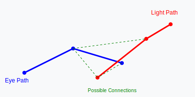

# Advanced Path Tracing: A Comprehensive Mathematical and Physical Analysis

## Abstract
This paper provides a comprehensive analysis of path tracing as a method for solving the Rendering Equation. We explore the transition from recursive ray tracing to stochastic path integration, the mathematical foundations of Monte Carlo methods in high-dimensional spaces, the physics of light transport through various media, and modern optimization techniques including Importance Sampling, Next Event Estimation (NEE), and Metropolis Light Transport (MLT).

---

## 1. Introduction: The Evolution of Rendering
The history of real-time and offline rendering is a progression toward solving the **Rendering Equation**. Early methods like Whitted's Ray Tracing (1980) could simulate specular reflections and shadows but failed to capture "soft" effects like indirect illumination or diffuse inter-reflections.

In 1986, James Kajiya introduced **Path Tracing**, which shifted the paradigm from explicitly tracing rays to light sources to stochastically sampling paths of light. By treating rendering as a Monte Carlo problem, path tracing provides a unified framework for simulating complex phenomena such as global illumination (GI), subsurface scattering, and participating media.

---

## 2. The Physics of Light Transport
To understand path tracing, one must first define the physical quantities involved in light transport.

### 2.1 Radiance vs. Irradiance
**Radiance ($L$)** is the amount of light that reaches an observer from a specific direction. It is defined as:
$$L(x, \omega) = \frac{dH(x, \omega)}{dA \cdot \cos\theta}$$
where $H$ is the radiant flux, $A$ is the area, and $\theta$ is the angle between the surface normal and the direction of travel.

**Irradiance ($E$)** is the total amount of light falling on a surface from all directions:
$$E(x) = \int_{\Omega} L(x, \omega_i) \cos(\theta_i) d\omega_i$$

### 2.2 The Rendering Equation
The core of path tracing is the **Rendering Equation**:
$$L_o(x, \omega_o) = L_e(x, \omega_o) + \int_{\Omega} f_r(x, \omega_i, \omega_o) L_i(x, \omega_i) \cos(\theta_i) d\omega_i$$

Where:
- $L_o$ is the outgoing radiance.
- $L_e$ is the emitted radiance (light sources).
- $f_r$ is the **Bidirectional Reflectance Distribution Function (BRDF)**, which defines how light is reflected at a surface point.
- $\cos(\theta_i)$ is the Lambertian cosine factor.

---

## 3. Monte Carlo Integration and Variance Reduction
Because the integral in the Rendering Equation is often impossible to solve analytically, we use **Monte Carlo (MC) integration**. The integral over the hemisphere $\Omega$ is estimated by sampling $N$ rays:

$$\int_{\Omega} g(\omega) d\omega \approx \frac{1}{N} \sum_{i=1}^{N} \frac{g(\omega_i)}{p(\omega_i)}$$

### 3.1 Importance Sampling
To reduce the variance (noise) in our estimate, we choose a Probability Density Function (PDF), $p(\omega)$, that matches the shape of the integrand. For a Lambertian surface, where $f_r = \frac{\rho}{\pi}$, the optimal PDF is:
$$p(\omega) = \frac{\cos(\theta)}{\pi}$$
By choosing this, the $\cos(\theta)$ term in the Rendering Equation and the denominator of the MC estimator cancel out, significantly reducing noise.

### 3.2 Low-Discrepancy Sequences
Standard pseudo-random numbers can lead to "clumping" or "holes" in sampling. To achieve faster convergence, we use **Quasi-Monte Carlo (QMC)** methods using Sobol or Halton sequences, which distribute samples more uniformly across the domain.

---

## 4. Geometry and Acceleration Structures
To make path tracing computationally feasible, we must efficiently determine where a ray intersects geometry.

### 4.1 The Moeller-Trumbore Algorithm
For triangle meshes, the intersection is calculated by solving:
$$O + tD = (1 - u - v)P_1 + uP_2 + vP_3$$
This allows for $O(1)$ intersection tests per ray against a single triangle.

### 4.2 Bounding Volume Hierarchies (BVH)
To avoid testing every triangle in a scene, we organize geometry into a tree of bounding volumes (AABBs). This reduces the complexity from $O(N)$ to $O(\log N)$. Modern implementations use **SAH (Surface Area Heuristic)** to optimize the construction of these trees.

---

## 5. Material Modeling: BRDFs and BSDFs
Real-world materials are modeled using complex functions that describe how light interacts with microscopic surface structures.

### 5.1 The Cook-Torrance Microfacet Model
For metallic and dielectric surfaces, we use the microfacet model:
$$f_r = \frac{D(h)F(v, h)G(l, h, v)}{4(\omega_r \cdot \omega_i)(\omega_r \cdot \omega_o)}$$
- **D (Distribution)**: The GGX distribution models the orientation of microfacets.
- **F (Fresnel)**: The Schlick approximation determines how much light is reflected vs. refracted based on the viewing angle.
- **G (Geometry)**: Accounts for self-shadowing of microfacets.

### 5.2 BSDFs and Participating Media
For materials like skin, clouds, or water, we use **Bidirectional Scattering Distribution Functions (BSDF)**. These include the **Phase Function** $p(\theta)$ to describe how light scatters in a medium (e.g., the Henyey-Greenstein phase function).

---

## 6. Advanced Path Tracing Techniques
To solve specific "hard" problems in rendering, several advanced techniques are employed:

### 6.1 Next Event Estimation (NEE)
In scenes with small light sources, a random path is unlikely to hit the light directly. NEE solves this by explicitly sampling light sources at every bounce:
$$L_{direct} = \sum_{l \in Lights} \frac{f_r(x, \omega_i, \omega_o) L_e(x, \omega_i) \cos(\theta_i)}{p(\omega_i)}$$

### 6.2 Bidirectional Path Tracing (BDPT)
Bidirectional Path Tracing (BDPT) addresses the difficulty of sampling complex light paths—such as those involving multiple specular reflections or refractions (caustics)—by generating two paths simultaneously: one starting from the camera (**eye path**) and one starting from a light source (**light path**).

Instead of just "connecting" them at the end, BDPT considers every vertex on the eye path and attempts to connect it to every vertex on the light path. A connection is valid if there is a direct line of sight between the two vertices (i.e., no geometry blocks the path). This allows the algorithm to find paths that are statistically "rare" in unidirectional sampling but physically significant, such as light reflecting off a mirror and then hitting a refractive surface before reaching the eye.

This approach ensures that even if a light path is very "difficult" to find from the camera's perspective, it can still be captured by the bidirectional search.

### 6.4 Russian Roulette
To manage the depth of recursion without introducing bias into the final image, **Russian Roulette** is employed. In a path tracing context, as a ray travels deeper into a scene, its contribution to the final image may diminish. Instead of using a fixed maximum depth (which can lead to biased results if paths are cut off prematurely), Russian Roulette randomly determines whether a path should continue based on its current energy.

Mathematically, at each bounce, we determine a probability $P$ that the ray continues:
$$P = \frac{\text{Current Energy}}{\text{Current Energy} + \text{Threshold}}$$
A random number $\xi \in [0,1]$ is generated; if $\xi < P$, the path continues and its contribution is scaled by $1/P$. If $\xi \geq P$, the path is terminated. This ensures that while some paths are discarded, the expected value of the remaining paths remains unbiased, allowing for an infinite theoretical depth with a finite average computation time.

---

## 8. GPU Acceleration and Optimization
To transition from a theoretical path tracer to a high-performance production renderer, the algorithm must be optimized for the massively parallel architecture of modern GPUs (e.g., NVIDIA CUDA/OptiX or AMD ROCm).

### 8.1 Spatial Partitioning and BVH Construction
The primary bottleneck in GPU ray tracing is the cost of intersection tests. To mitigate this, we employ **Bounding Volume Hierarchies (BVH)**. A scene's geometry is organized into a tree where each node contains a bounding volume (typically an Axis-Aligned Bounding Box, AABB).

To optimize the construction of these trees, we utilize the **Surface Area Heuristic (SAH)**. The cost of a partition is defined as:
$$Cost = C_{traversal} + \frac{Area(A)}{Area(Parent)} \cdot N_A \cdot C_{intersection} + \frac{Area(B)}{Area(Parent)} \cdot N_B \cdot C_{intersection}$$
By minimizing this cost during construction, we ensure that the most likely paths for a ray are pruned as early as possible, significantly reducing the number of intersection tests.

### 8.2 Mitigating SIMD Divergence
GPUs execute threads in groups (Warps or Wavefronts). When different threads in a group follow different execution paths (e.g., one hits a triangle while another misses), it causes **Branch Divergence**, forcing the hardware to serialize the operations.

*   **Ray Bundling:** Instead of processing rays individually, we group "coherent" rays—those traveling in similar directions or hitting the same BVH nodes—into bundles. This ensures that all threads in a warp are executing the same instructions simultaneously.
*   **Wide BVH (e.g., 4-way or 8-way):** Unlike binary trees, Wide BVHs allow a single GPU instruction to test multiple child nodes at once. This reduces the depth of the tree and improves the utilization of SIMD lanes.

### 8.3 Memory Management and Bindless Resources
Modern GPUs suffer from overhead when switching between different material states or textures. **Bindless Rendering** allows the GPU to access an arbitrary number of textures and buffers without re-binding them for every ray hit. This is critical for path tracing, where a single ray may encounter dozens of different materials in a single frame.

### 8.4 Optimized Intersection Kernels
While the Möller-Trumbore algorithm is standard, it involves several divisions. For GPU kernels, we often use **pre-transformed triangle data** and simplified intersection tests that rely on Multiply-Add (MAD) instructions, which are highly optimized in hardware.

---

## Conclusion
Path tracing is more than just an algorithm; it is a rigorous application of physics and probability to the problem of light transport. By combining the Rendering Equation with Monte Carlo integration and advanced sampling techniques like NEE and MLT, we can simulate the complexities of the real world with unprecedented accuracy. As hardware continues to evolve, the marriage of path tracing with machine learning will continue to push the boundaries of what is possible in visual media.
